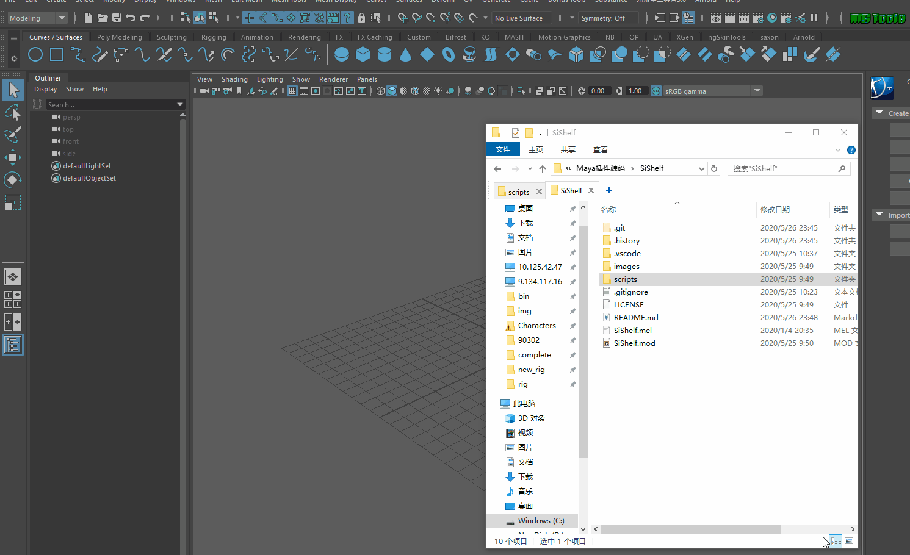
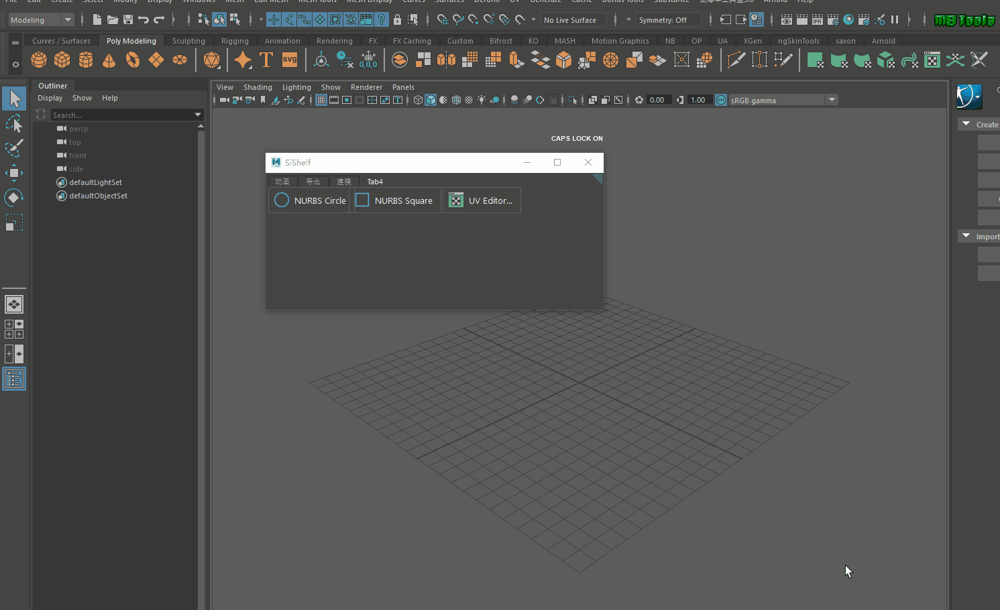
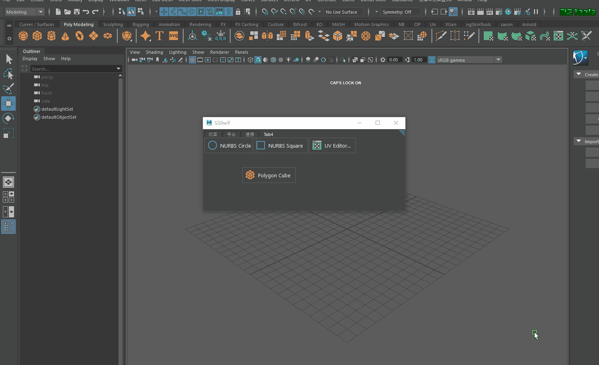

# SiShelf [Var.1.7.3]

原仓库在此 [SiShelf](https://github.com/mochio326/SiShelf) 

添加了一个可以缩小的工具架的角标功能
简化 Maya 工具架图标的添加
使用模块化安装，简化安装的流程

安装方法使用了 RJ 大神的 模块化安装，直接拖拽安装。

更好地兼容工具架图标的添加

可以缩小成一个小图标，小图标右键支持 XPOP 模式
